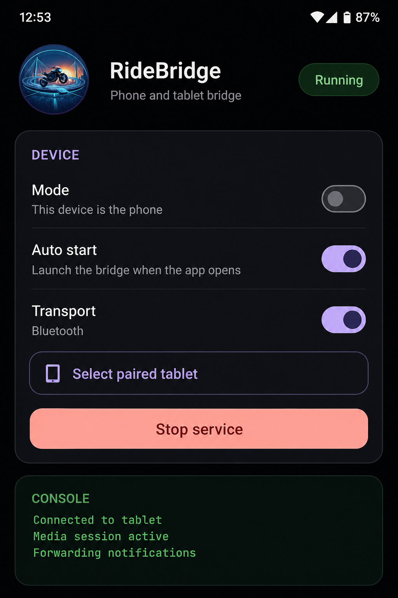

# RideBridge

Phone companion for **[RideMode](../RideMode)**. It bridges media, notifications, and voice destinations to the dash over Bluetooth (or TCP for debugging).

Run this on the phone in your pocket or tank bag. RideMode on the tablet is the dashboard.

## What it does

- Forwards now-playing track, artist, and album art to the dash
- Forwards selected notifications
- Voice assist can send a `NAV` destination to RideMode
- Optional auto-start when the app opens

## Development Status

RideBridge is in active development alongside RideMode.
